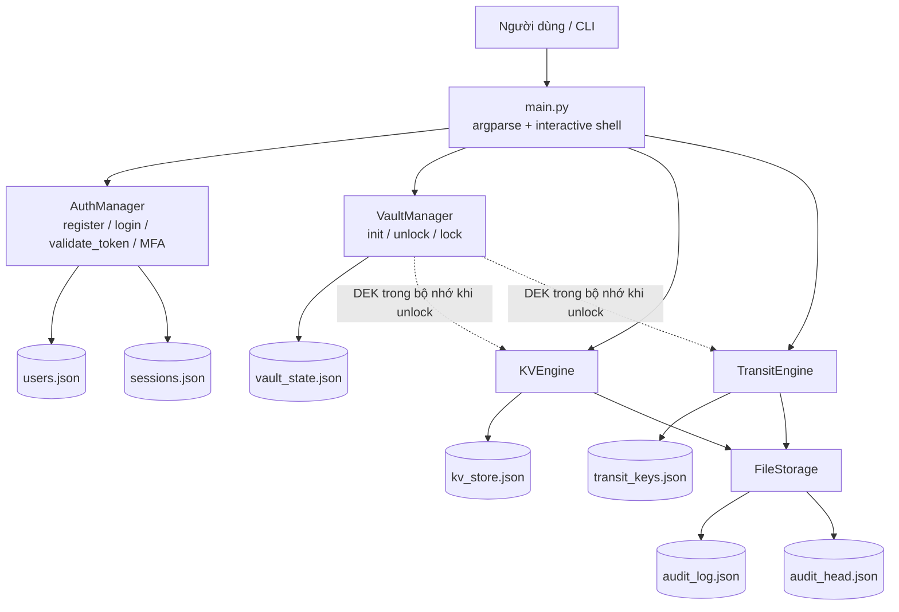
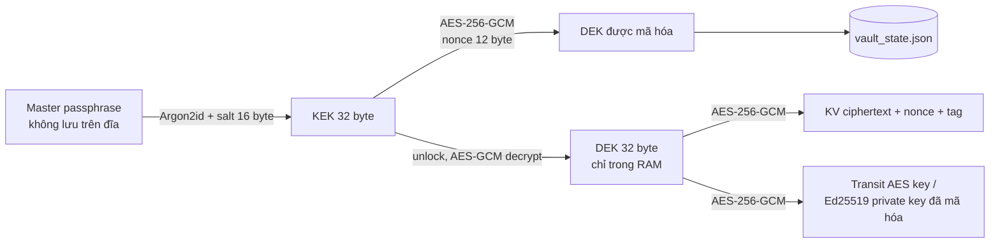

# BÁO CÁO ĐỒ ÁN MINI VAULT

> **Lưu ý điền thông tin trước khi nộp:** Các trường trong ngoặc vuông là placeholder vì repository không có dữ liệu đáng tin cậy về thành viên, MSSV, phân công hoặc ngày nộp. Không thay thế bằng thông tin suy đoán.

| Hạng mục   | Thông tin                                             |
| ---------- | ----------------------------------------------------- |
| Học phần   | [Tên học phần]                                        |
| Đề tài     | **Mini Vault – Vault cục bộ có KV mã hóa và Transit** |
| Nhóm       | [Tên/Số nhóm]                                         |
| Giảng viên | [Họ tên giảng viên]                                   |
| Ngày nộp   | [dd/mm/yyyy]                                          |
| Repository | `mini_vault`                                          |

## Thành viên và phân công

| STT | Họ và tên       | MSSV            | Phân công thực tế | Mức đóng góp  |
| --: | --------------- | --------------- | ----------------- | ------------- |
|   1 | [Chưa cung cấp] | [Chưa cung cấp] | [Bổ sung sau]     | [Bổ sung sau] |
|   2 | [Chưa cung cấp] | [Chưa cung cấp] | [Bổ sung sau]     | [Bổ sung sau] |
|   3 | [Chưa cung cấp] | [Chưa cung cấp] | [Bổ sung sau]     | [Bổ sung sau] |

---

## 1. Mục tiêu và phạm vi

Mini Vault là ứng dụng dòng lệnh (CLI) mô phỏng các chức năng cốt lõi của một vault quản lý bí mật:

- khởi tạo, mở khóa và khóa vault bằng **master passphrase**;
- đăng ký/đăng nhập người dùng, session token và khóa tạm thời khi nhập sai nhiều lần;
- lưu trữ JSON secret theo namespace người dùng bằng **KV engine** có mã hóa;
- quản lý khóa Transit để mã hóa/giải mã và ký/xác minh chữ ký số;
- các chức năng bổ sung: MFA TOTP, KV versioning, audit log hash-chain.

Phạm vi là ứng dụng local-file, chạy trong một máy và một tiến trình CLI/shell. Đây **không** phải dịch vụ Vault mạng hoàn chỉnh, không có REST API, RBAC/policy engine, chia sẻ secret đa người dùng, backup/recovery hay key rotation.

## 2. Công nghệ và cấu trúc mã nguồn

### 2.1. Công nghệ

| Thành phần      | Công nghệ/cơ chế                                                                |
| --------------- | ------------------------------------------------------------------------------- |
| Ngôn ngữ, CLI   | Python, `argparse`, interactive shell                                           |
| KDF             | Argon2id (`argon2-cffi`) cho KEK; Argon2 PasswordHasher cho mật khẩu người dùng |
| Mã hóa đối xứng | AES-256-GCM (`cryptography`)                                                    |
| Chữ ký số       | Ed25519; SHA-256 cho message kiểu `RAW`                                         |
| MFA             | TOTP 6 chữ số, HMAC-SHA-1, chu kỳ 30 giây                                       |
| Lưu trữ         | JSON local files qua `FileStorage`                                              |
| Kiểm thử        | `pytest` – 8 test trong `tests/test_mini_vault.py`                              |

### 2.2. Cấu trúc module

| Đường dẫn                  | Trách nhiệm                                                                                   |
| -------------------------- | --------------------------------------------------------------------------------------------- |
| `main.py`                  | Parser CLI, dispatch lệnh, `require_token`, shell giữ trạng thái unlock trong cùng tiến trình |
| `src/core/vault.py`        | Vòng đời Vault, dẫn xuất KEK, bao/mở DEK và AES-GCM dùng DEK                                  |
| `src/auth/auth.py`         | Đăng ký, đăng nhập, session token, lockout, TOTP MFA                                          |
| `src/kv/engine.py`         | KV encrypted storage, namespace owner và versioning                                           |
| `src/transit/engine.py`    | Quản lý khóa, encrypt/decrypt, sign/verify                                                    |
| `src/storage/storage.py`   | Đọc/ghi JSON và audit hash-chain                                                              |
| `tests/test_mini_vault.py` | Acceptance/security tests                                                                     |

### 2.3. Kiến trúc tổng quan



### 2.4. Phân cấp khóa



Đoạn code tạo salt 16 byte, DEK ngẫu nhiên 32 byte và nonce 12 byte; `_derive_kek` dùng Argon2id với `time_cost=2`, `memory_cost=65536`, `parallelism=2`, kết quả 32 byte. File vault chỉ lưu salt, DEK đã mã hóa, nonce và trạng thái logic `locked`; không lưu master passphrase hoặc DEK plaintext.

```python
salt = os.urandom(16)
kek = self._derive_kek(master_passphrase.encode("utf-8"), salt)
dek = os.urandom(32)
nonce = os.urandom(12)
encrypted_dek = AESGCM(kek).encrypt(nonce, dek, None)

state = {
    "kdf": self.KDF,
    "kdf_salt_b64": base64.b64encode(salt).decode("ascii"),
    "encrypted_dek_b64": base64.b64encode(encrypted_dek).decode("ascii"),
    "encrypted_dek_nonce_b64": base64.b64encode(nonce).decode("ascii"),
    "status": "locked",
}

return hash_secret_raw(
    secret=passphrase, salt=salt, time_cost=2, memory_cost=65536,
    parallelism=2, hash_len=32, type=Type.ID,
)
```

### 2.5. Mô hình các file runtime

| File                                | Nội dung chính                                              | Dữ liệu nhạy cảm/lưu ý                                                    |
| ----------------------------------- | ----------------------------------------------------------- | ------------------------------------------------------------------------- |
| `vault_state.json`                  | KDF, salt, encrypted DEK, nonce, status                     | Không chứa master passphrase/DEK rõ                                       |
| `users.json`                        | Argon2 password hash, lockout, cấu hình MFA mã hóa          | Không chứa password hay TOTP secret rõ                                    |
| `sessions.json`                     | token, email, thời gian hết hạn                             | Token bearer đang được lưu raw; cần bảo vệ quyền truy cập thư mục dữ liệu |
| `kv_store.json`                     | path, version, nonce, ciphertext, GCM tag, metadata/lịch sử | Không chứa plaintext secret                                               |
| `transit_keys.json`                 | metadata và key/private key đã được DEK mã hóa              | Public key Ed25519 được lưu Base64 là dữ liệu công khai                   |
| `audit_log.json`, `audit_head.json` | sự kiện, liên kết hash và trạng thái head                   | Hash-chain phát hiện sửa đổi không nhất quán với chain/head               |

---

## 3. Đáp ứng yêu cầu bắt buộc

### 0.1. Khởi tạo, mở khóa và khóa Vault

**Thiết kế/hiện thực.** Đoạn mã sau kiểm tra passphrase tối thiểu 12 ký tự, dùng Argon2id để tạo KEK, sinh DEK 256 bit và lưu DEK dưới dạng AES-GCM ciphertext.

```python
def initialize(self, master_passphrase: str):
    if self.is_initialized():
        raise VaultError("Vault already initialized")
    if not master_passphrase or len(master_passphrase) < 12:
        raise VaultError("Master passphrase must be at least 12 characters")

    salt = os.urandom(16)
    kek = self._derive_kek(master_passphrase.encode("utf-8"), salt)
    dek = os.urandom(32)
    nonce = os.urandom(12)
    encrypted_dek = AESGCM(kek).encrypt(nonce, dek, None)

    state = {
        "kdf": self.KDF,
        "kdf_salt_b64": base64.b64encode(salt).decode("ascii"),
        "encrypted_dek_b64": base64.b64encode(encrypted_dek).decode("ascii"),
        "encrypted_dek_nonce_b64": base64.b64encode(nonce).decode("ascii"),
        "status": "locked",
    }
    self.storage.write_json(self.STATE_FILE, state)
    return state

@staticmethod
def _derive_kek(passphrase: bytes, salt: bytes) -> bytes:
    return hash_secret_raw(
        secret=passphrase, salt=salt, time_cost=2, memory_cost=65536,
        parallelism=2, hash_len=32, type=Type.ID,
    )
```

Khi mở khóa, KEK được dẫn xuất lại để giải mã DEK. DEK chỉ nằm trong `self._dek` của tiến trình; khi khóa, tham chiếu này bị xóa và mọi thao tác cần DEK trả `VAULT_LOCKED`.

```python
def unlock(self, master_passphrase: str):
    state = self.storage.read_json(self.STATE_FILE)
    if state is None:
        raise VaultError("Vault is not initialized")
    try:
        salt = base64.b64decode(state["kdf_salt_b64"])
        nonce = base64.b64decode(state["encrypted_dek_nonce_b64"])
        encrypted_dek = base64.b64decode(state["encrypted_dek_b64"])
    except Exception as exc:
        raise VaultError("Vault state is corrupted") from exc

    kek = self._derive_kek(master_passphrase.encode("utf-8"), salt)
    try:
        self._dek = AESGCM(kek).decrypt(nonce, encrypted_dek, None)
    except Exception as exc:
        raise VaultError("Invalid master passphrase") from exc
    return True

def lock(self):
    self._dek = None

def get_dek(self) -> bytes:
    if not self.is_unlocked():
        raise VaultLockedError("VAULT_LOCKED")
    return self._dek
```

**Kiểm soát trên CLI.** CLI thực hiện unlock/lock trong cùng process. Khi thoát interactive shell, vault luôn được lock.

```python
if args.command == "unlock":
    master_passphrase = args.master_passphrase or prompt_passphrase(
        "Master passphrase: "
    )
    vault.unlock(master_passphrase)
    print("Vault unlocked for current process.")
    return

if args.command == "lock":
    vault.lock()
    print("Vault locked.")
    return

# Cuối interactive_shell(...)
app[1].lock()
print("Vault locked. Goodbye.")
```

**Minh chứng test.**

```python
vault.initialize("strong-master-passphrase")
state = storage.read_json("vault_state.json")
assert state["kdf"] == "argon2id"
assert state["status"] == "locked"
with pytest.raises(VaultLockedError):
    vault.get_dek()
assert vault.unlock("strong-master-passphrase") is True
vault.lock()
with pytest.raises(VaultLockedError):
    vault.get_dek()
```

### 0.2. Xác thực người dùng, session và lockout

**Đăng ký.** Mật khẩu được băm bằng Argon2 trước khi lưu; email được chuẩn hóa lowercase, kiểm tra định dạng và passphrase phải có ít nhất 12 ký tự.

```python
def __init__(self, storage: FileStorage):
    self.storage = storage
    self.password_hasher = PasswordHasher(
        time_cost=2, memory_cost=102400, parallelism=2
    )

def register(self, email: str, passphrase: str, confirm_passphrase: str):
    email = email.strip().lower()
    if not self._validate_email(email):
        raise AuthError("Invalid email address")
    if passphrase != confirm_passphrase:
        raise AuthError("Passphrases do not match")
    if len(passphrase) < 12:
        raise AuthError("Passphrase must be at least 12 characters")

    users = self._load_users()
    if email in users:
        raise AuthError("Email already registered")
    users[email] = {
        "email": email,
        "password_hash": self.password_hasher.hash(passphrase),
        "failed_attempts": 0,
        "locked_until": None,
        "created_at": self.storage.now_iso(),
    }
    self._save_users(users)
    return users[email]
```

**Đăng nhập/session và lockout.** Sau năm lần sai mật khẩu, tài khoản bị khóa năm phút. Đăng nhập thành công tạo token bearer ngẫu nhiên từ 24 byte với thời hạn 30 phút.

```python
SESSION_TTL = timedelta(minutes=30)
LOCK_DURATION = timedelta(minutes=5)
MAX_FAILURES = 5

try:
    self.password_hasher.verify(user["password_hash"], passphrase)
except VerifyMismatchError:
    user["failed_attempts"] = user.get("failed_attempts", 0) + 1
    if user["failed_attempts"] >= self.MAX_FAILURES:
        lock_until = datetime.now(timezone.utc) + self.LOCK_DURATION
        user["locked_until"] = (
            lock_until.replace(microsecond=0).isoformat().replace("+00:00", "Z")
        )
    self._save_users(users)
    raise AuthenticationError("Invalid credentials")

user["failed_attempts"] = 0
user["locked_until"] = None
self._save_users(users)
token = base64.urlsafe_b64encode(os.urandom(24)).decode("ascii").rstrip("=")
expires_at = (datetime.now(timezone.utc) + self.SESSION_TTL).replace(
    microsecond=0
).isoformat().replace("+00:00", "Z")
sessions[token] = {
    "token": token, "email": email, "expires_at": expires_at,
    "created_at": self.storage.now_iso(),
}
self._save_sessions(sessions)
return token
```

Token được kiểm tra trước khi CLI dispatch các lệnh KV/Transit.

```python
def validate_token(self, token: str) -> str:
    sessions = self._load_sessions()
    session = sessions.get(token)
    if not session:
        raise AuthenticationError("UNAUTHENTICATED")
    expires_at = datetime.fromisoformat(session["expires_at"].replace("Z", "+00:00"))
    if datetime.now(timezone.utc) >= expires_at:
        del sessions[token]
        self._save_sessions(sessions)
        raise AuthenticationError("Session token expired")
    return session["email"]

def require_token(auth: AuthManager, token: str) -> str:
    try:
        return auth.validate_token(token)
    except AuthenticationError as exc:
        raise AuthError(str(exc)) from exc
```

**Minh chứng test.**

```python
token = auth.login("alice@example.com", "supersecurepassword")
assert auth.validate_token(token) == "alice@example.com"
for _ in range(5):
    with pytest.raises(AuthenticationError):
        auth.login("alice@example.com", "wrong-password")
with pytest.raises(AuthenticationError):
    auth.login("alice@example.com", "supersecurepassword")
```

### 1.1. KV encrypted storage

`write` yêu cầu vault unlocked, serialize JSON compact, mã hóa bằng DEK và tách ciphertext/tag để lưu. Mỗi lần ghi dùng nonce AES-GCM mới 12 byte.

```python
def write(self, owner_email: str, path: str, data: Any):
    if not self.vault.is_unlocked():
        raise VaultLockedError("VAULT_LOCKED")
    path = self._normalize_path(owner_email, path)
    payload = json.dumps(data, separators=(",", ":")).encode("utf-8")
    nonce, ciphertext = self.vault.encrypt_with_dek(payload)

    ciphertext_b64 = base64.b64encode(ciphertext[:-16]).decode("ascii")
    tag_b64 = base64.b64encode(ciphertext[-16:]).decode("ascii")
    store = self.storage.read_json(self.STORE_FILE, {})
    now = self.storage.now_iso()
    existing = store.get(path)
    versions = list(existing.get("versions", [])) if existing else []
    if existing:
        versions.append(self._snapshot(existing))
    version = int(existing.get("version", 1)) + 1 if existing else 1
    record = {
        "path": path, "version": version,
        "nonce_b64": base64.b64encode(nonce).decode("ascii"),
        "ciphertext_b64": ciphertext_b64, "tag_b64": tag_b64,
        "created_at": store.get(path, {}).get("created_at", now),
        "updated_at": now, "versions": versions,
    }
    store[path] = record
    self.storage.write_json(self.STORE_FILE, store)
    return self._metadata(record)

def encrypt_with_dek(self, plaintext: bytes, associated_data=None):
    dek = self.get_dek()
    nonce = os.urandom(12)
    ciphertext = AESGCM(dek).encrypt(nonce, plaintext, associated_data)
    return nonce, ciphertext
```

Khi đọc, ciphertext và tag được ghép lại để AES-GCM xác thực. Mọi lỗi dữ liệu/mã hóa được trả về dưới dạng `DATA_TAMPERED`.

```python
def read(self, owner_email: str, path: str, version: int = None) -> Any:
    if not self.vault.is_unlocked():
        raise VaultLockedError("VAULT_LOCKED")
    path = self._normalize_path(owner_email, path)
    record = self.storage.read_json(self.STORE_FILE, {}).get(path)
    if record is None:
        raise NotFoundError("NOT_FOUND")
    selected = self._select_version(record, version)
    try:
        nonce = base64.b64decode(selected["nonce_b64"])
        ciphertext = base64.b64decode(selected["ciphertext_b64"])
        tag = base64.b64decode(selected["tag_b64"])
        plaintext = self.vault.decrypt_with_dek(nonce, ciphertext + tag)
        return json.loads(plaintext.decode("utf-8"))
    except Exception:
        raise KVError("DATA_TAMPERED")
```

**Minh chứng test.**

```python
kv.write(email, "secret/db", {"password": "hunter2"})
assert kv.read(email, "secret/db") == {"password": "hunter2"}
assert "hunter2" not in json.dumps(storage.read_json("kv_store.json"))
store["secret/alice@example.com/db"]["tag_b64"] = base64.b64encode(b"x" * 16).decode("ascii")
with pytest.raises(Exception, match="DATA_TAMPERED"):
    kv.read(email, "secret/db")
```

### 1.2. Namespace ownership và kiểm soát truy cập KV

Hàm sau chuẩn hóa path về `secret/<owner-email>/...`. Nếu explicit path mang email của người dùng khác, nó ghi audit event và từ chối trước khi decrypt.

```python
def _normalize_path(self, owner_email: str, path: str) -> str:
    path = path.strip().lstrip("/")
    if path.startswith("secret/"):
        candidate = path.split("/", 2)
        if candidate[1] == owner_email:
            if len(candidate) < 3 or not candidate[2]:
                raise KVError("Invalid secret path")
            return path
        if "@" in candidate[1]:
            self._log_denied(owner_email, path, "KV")
            raise PermissionDenied("PERMISSION_DENIED")
        path = path[len("secret/"):]
    if not path:
        raise KVError("Invalid secret path")
    return f"secret/{owner_email}/{path}"

def _log_denied(self, owner_email: str, path: str, source: str):
    self.storage.append_audit({
        "timestamp": self.storage.now_iso(),
        "type": "PERMISSION_DENIED",
        "source": source,
        "requester": owner_email,
        "resource": path,
    })
```

**Minh chứng test.**

```python
with pytest.raises(PermissionDenied):
    kv.read("bob@example.com", "secret/alice@example.com/db")
audit = storage.read_json("audit_log.json")
assert audit[-1]["requester"] == "bob@example.com"
assert audit[-1]["resource"] == "secret/alice@example.com/db"
```

### 2.1. Quản lý Transit key và bảo vệ key material

Khóa mã hóa là 32 byte ngẫu nhiên. Private key Ed25519 và AES key đều được mã hóa bằng DEK trước khi ghi; API chỉ trả metadata, không trả material.

```python
def create_key(self, owner_email: str, key_name: str):
    self._ensure_unlocked()
    self._ensure_name(key_name)
    store = self.storage.read_json(self.STORE_FILE, {})
    key_id = self._storage_key(owner_email, key_name)
    if key_id in store:
        raise TransitError("Key already exists")
    key_material = os.urandom(32)
    encrypted_key, nonce = self._encrypt_key_material(key_material)
    store[key_id] = {
        "key_name": key_name, "owner_email": owner_email,
        "key_usage": self.ENCRYPT_DECRYPT,
        "encrypted_key_material_b64": base64.b64encode(encrypted_key).decode("ascii"),
        "encrypted_key_nonce_b64": base64.b64encode(nonce).decode("ascii"),
        "signing_algorithm": None, "public_key_b64": None,
        "created_at": self.storage.now_iso(), "updated_at": self.storage.now_iso(),
    }
    self.storage.write_json(self.STORE_FILE, store)
    return {"key_name": key_name, "key_usage": self.ENCRYPT_DECRYPT}

def _encrypt_key_material(self, key_material: bytes):
    nonce = os.urandom(12)
    encrypted = AESGCM(self.vault.get_dek()).encrypt(nonce, key_material, None)
    return encrypted, nonce
```

```python
def create_signing_key(self, owner_email: str, key_name: str, signing_algorithm: str):
    self._ensure_unlocked()
    if signing_algorithm != self.SIGNING_ALGORITHM:
        raise TransitError("Unsupported signing algorithm")
    private_key = Ed25519PrivateKey.generate()
    public_key = private_key.public_key()
    private_bytes = private_key.private_bytes(
        encoding=Encoding.Raw, format=PrivateFormat.Raw,
        encryption_algorithm=NoEncryption(),
    )
    public_bytes = public_key.public_bytes(
        encoding=Encoding.Raw, format=PublicFormat.Raw,
    )
    encrypted_key, nonce = self._encrypt_key_material(private_bytes)
    # Record lưu encrypted_private_key_b64, encrypted_key_nonce_b64 và public_key_b64.
```

Ownership của key được ràng buộc qua record ID `<owner_email>|<key_name>`. Key cùng tên thuộc owner khác bị từ chối và audit; `revoke_key` xóa record.

```python
def _require_key_record(self, owner_email: str, key_name: str) -> Dict[str, Any]:
    store = self.storage.read_json(self.STORE_FILE, {})
    key_id = self._storage_key(owner_email, key_name)
    if key_id in store:
        return store[key_id]
    if self._key_name_exists_elsewhere(key_name, owner_email, store):
        self._log_denied(owner_email, key_name, "TRANSIT")
        raise PermissionDenied("PERMISSION_DENIED")
    raise NotFoundError("NOT_FOUND")

def _storage_key(self, owner_email: str, key_name: str) -> str:
    return f"{owner_email}|{key_name}"
```

**Minh chứng test.**

```python
key = transit.create_key("alice@example.com", "my-key")
assert key["key_usage"] == "ENCRYPT_DECRYPT"
stored_key = storage.read_json("transit_keys.json")["alice@example.com|my-key"]
assert "encrypted_key_material_b64" in stored_key
assert "key_material" not in key
transit.revoke_key("alice@example.com", "my-key")
with pytest.raises(TransitNotFound):
    transit.decrypt("alice@example.com", ciphertext)
```

### 2.2. Transit encrypt/decrypt

`encrypt` chỉ dùng key có usage `ENCRYPT_DECRYPT`, giải mã material trong bộ nhớ rồi tạo ciphertext theo format `vault:<key-name>:<base64(nonce+ciphertext+tag)>`.

```python
def encrypt(self, owner_email: str, key_name: str, plaintext: bytes) -> str:
    self._ensure_unlocked()
    record = self._require_key_record(owner_email, key_name)
    if record["key_usage"] != self.ENCRYPT_DECRYPT:
        raise InvalidKeyUsageError("InvalidKeyUsageException")
    key_material = self._decrypt_key_material(record)
    nonce = os.urandom(12)
    ciphertext = AESGCM(key_material).encrypt(nonce, plaintext, None)
    payload = base64.b64encode(nonce + ciphertext).decode("ascii")
    return f"{self.CIPHERTEXT_PREFIX}:{key_name}:{payload}"

def decode_base64(value: str, field_name: str) -> bytes:
    try:
        return base64.b64decode(value, validate=True)
    except (binascii.Error, ValueError) as exc:
        raise TransitError(f"Invalid base64 for {field_name}") from exc
```

`decrypt` kiểm tra format, Base64, độ dài payload, ownership và AES-GCM tag.

```python
def decrypt(self, owner_email: str, ciphertext: str) -> bytes:
    self._ensure_unlocked()
    parts = ciphertext.split(":", 2)
    if len(parts) != 3 or parts[0] != self.CIPHERTEXT_PREFIX:
        raise BadCiphertextError("Malformed ciphertext")
    key_name, payload = parts[1], parts[2]
    try:
        raw = base64.b64decode(payload, validate=True)
        if len(raw) < 12 + 16:
            raise ValueError("ciphertext is too short")
        nonce, token = raw[:12], raw[12:]
    except (ValueError, TypeError) as exc:
        raise BadCiphertextError("Malformed ciphertext") from exc
    record = self._require_key_record(owner_email, key_name)
    if record["key_usage"] != self.ENCRYPT_DECRYPT:
        raise InvalidKeyUsageError("InvalidKeyUsageException")
    try:
        return AESGCM(self._decrypt_key_material(record)).decrypt(nonce, token, None)
    except Exception:
        raise TransitError("GCM tag mismatch")
```

**Minh chứng test.**

```python
ciphertext = transit.encrypt("alice@example.com", "my-key", b"hello world")
assert ciphertext.startswith("vault:my-key:")
assert transit.decrypt("alice@example.com", ciphertext) == b"hello world"
with pytest.raises(BadCiphertextError):
    transit.decrypt("alice@example.com", "vault:my-key:not-base64!")
with pytest.raises(TransitPermissionDenied):
    transit.encrypt("bob@example.com", "my-key", b"data")
```

### 2.3. Tạo chữ ký số

Chức năng ký chỉ chấp nhận key `SIGN_VERIFY` sử dụng Ed25519. `RAW` được băm SHA-256; `DIGEST` bắt buộc chính xác 32 byte.

```python
def sign(self, owner_email: str, key_name: str, message_b64: str, message_type: str):
    self._ensure_unlocked()
    record = self._require_key_record(owner_email, key_name)
    if record["key_usage"] != self.SIGN_VERIFY:
        raise InvalidKeyUsageError("InvalidKeyUsageException")
    if record.get("signing_algorithm") != self.SIGNING_ALGORITHM:
        raise TransitError("Signing key algorithm mismatch")
    message = self._get_message_bytes(message_b64)
    digest = self._digest_message(message, message_type)
    private_key = Ed25519PrivateKey.from_private_bytes(
        self._decrypt_key_material(record)
    )
    signature = private_key.sign(digest)
    return {
        "signature_b64": base64.b64encode(signature).decode("ascii"),
        "key_name": key_name,
        "signing_algorithm": record["signing_algorithm"],
    }

def _digest_message(self, message: bytes, message_type: str) -> bytes:
    if message_type == "RAW":
        digest = hashes.Hash(hashes.SHA256())
        digest.update(message)
        return digest.finalize()
    if message_type == "DIGEST":
        if len(message) != 32:
            raise TransitError("Digest length mismatch")
        return message
    raise TransitError("Unsupported message_type")
```

**Minh chứng test.**

```python
message = base64.b64encode(b"payload bytes").decode("ascii")
sign_result = transit.sign("alice@example.com", "my-sign", message, "RAW")
assert sign_result["signing_algorithm"] == "ED25519"
short_digest = base64.b64encode(b"short").decode("ascii")
with pytest.raises(TransitError, match="Digest length mismatch"):
    transit.sign("alice@example.com", "my-sign", short_digest, "DIGEST")
```

### 2.4. Xác minh chữ ký số

`verify` kiểm tra vault, ownership và key usage như `sign`; sau đó xác minh bằng Ed25519 public key. Signature malformed hoặc không hợp lệ trả response với `signature_valid: false`, thay vì exception.

```python
def verify(self, owner_email: str, key_name: str, message_b64: str,
           message_type: str, signature_b64: str) -> Dict[str, Any]:
    self._ensure_unlocked()
    record = self._require_key_record(owner_email, key_name)
    if record["key_usage"] != self.SIGN_VERIFY:
        raise InvalidKeyUsageError("InvalidKeyUsageException")
    if record.get("signing_algorithm") != self.SIGNING_ALGORITHM:
        raise TransitError("Signing key algorithm mismatch")
    message = self._get_message_bytes(message_b64)
    digest = self._digest_message(message, message_type)
    try:
        signature = base64.b64decode(signature_b64, validate=True)
    except (ValueError, TypeError):
        return {"key_name": key_name, "signature_valid": False,
                "signing_algorithm": record.get("signing_algorithm")}
    public_bytes = base64.b64decode(record["public_key_b64"])
    public_key = Ed25519PublicKey.from_public_bytes(public_bytes)
    try:
        public_key.verify(signature, digest)
        return {"key_name": key_name, "signature_valid": True,
                "signing_algorithm": record.get("signing_algorithm")}
    except (InvalidSignature, ValueError):
        return {"key_name": key_name, "signature_valid": False,
                "signing_algorithm": record.get("signing_algorithm")}
```

**Minh chứng test.**

```python
result = transit.verify("alice@example.com", "my-sign", message, "RAW", signature)
assert result["signature_valid"] is True
bad_message = base64.b64encode(b"tampered").decode("ascii")
result_bad = transit.verify("alice@example.com", "my-sign", bad_message, "RAW", signature)
assert result_bad["signature_valid"] is False
assert transit.verify("alice@example.com", "my-sign", message, "RAW", "not-base64!")["signature_valid"] is False
```

---

## 4. Kiểm thử và truy vết yêu cầu

### 4.1. Chạy test

Từ root project:

```bash
python -m pytest -q
```

Tài liệu hướng dẫn dự án nêu kết quả kỳ vọng là `8 passed`. Bộ test cô lập dữ liệu bằng `tempfile.TemporaryDirectory`, tránh sử dụng dữ liệu runtime thật.

```python
def create_environment():
    temp_dir = tempfile.TemporaryDirectory()
    storage = FileStorage(temp_dir.name)
    vault = VaultManager(storage)
    auth = AuthManager(storage)
    kv = KVEngine(storage, vault)
    transit = TransitEngine(storage, vault)
    return temp_dir, storage, vault, auth, kv, transit
```

**Kết quả đã chạy tại môi trường rà soát:** `8 passed in 3.08s` bằng lệnh trên.

### 4.2. Ma trận requirement – mã nguồn – test – ảnh demo

| Yêu cầu | Mã nguồn chính                                                                                    | Test liên quan                                          | Ảnh cần bổ sung từ lượt chạy thật              |
| ------- | ------------------------------------------------------------------------------------------------- | ------------------------------------------------------- | ---------------------------------------------- |
| 0.1     | `src/core/vault.py` – `initialize`, `unlock`, `lock`, `_derive_kek`                               | `test_vault_initialize_and_unlock`; locked Transit test | `images/01_vault_init_unlock_lock.png`         |
| 0.2     | `src/auth/auth.py` – `register`, `login`, `validate_token`; `main.py` – `require_token`           | `test_auth_register_login_lockout`                      | `images/02_auth_login_lockout.png`             |
| 1.1     | `src/kv/engine.py` – `write`, `read`, `delete`                                                    | KV test                                                 | `images/03_kv_encrypt_read_tamper.png`         |
| 1.2     | `src/kv/engine.py` – `_normalize_path`, `_log_denied`                                             | KV ownership/audit test                                 | `images/04_kv_cross_owner_denial.png`          |
| 2.1     | `src/transit/engine.py` – `create_key`, `create_signing_key`, `_require_key_record`, `revoke_key` | Transit test                                            | `images/05_transit_key_lifecycle.png`          |
| 2.2     | `src/transit/engine.py` – `encrypt`, `decrypt`                                                    | Transit test                                            | `images/06_transit_encrypt_decrypt_denial.png` |
| 2.3     | `src/transit/engine.py` – `sign`, `_digest_message`                                               | Transit test                                            | `images/07_sign_raw_digest.png`                |
| 2.4     | `src/transit/engine.py` – `verify`                                                                | Transit test                                            | `images/08_verify_valid_tampered.png`          |

## 5. Kịch bản demo và vị trí ảnh minh chứng

Không có ảnh nào được tạo hoặc giả mạo trong repository. Các link dưới đây là **placeholder** cho ảnh terminal chụp từ một lượt chạy thật. Khi chèn ảnh, phải che master passphrase, session token, TOTP secret, `otpauth_uri`, ciphertext/signature nếu nhóm xem chúng là dữ liệu nhạy cảm.

### 5.1. Chuẩn bị

```bash
python -m pip install -r requirements.txt
python main.py --data-dir data-demo shell
```

Dùng `data-demo` hoặc thư mục tạm riêng cho demo, không chụp dữ liệu đã dùng thật.

### 5.2. Kịch bản

| Bước | Lệnh/hành động                                               | Kết quả cần quan sát                                                                            |
| ---: | ------------------------------------------------------------ | ----------------------------------------------------------------------------------------------- |
|    1 | `init`, `status`, `unlock`, `status`, `lock`                 | Vault khởi tạo ở `locked`, unlock trong tiến trình, lock trả `VAULT_LOCKED` cho thao tác bảo vệ |
|    2 | Register Alice/Bob; login Alice                              | Password không lưu rõ; nhận token đã che khi chụp                                               |
|    3 | Alice `write` secret v1, ghi v2, `list-versions`, read v1/v2 | Namespace Alice, version 1/2, đọc đúng lịch sử                                                  |
|    4 | Bob read path explicit của Alice                             | `PERMISSION_DENIED`; audit event được tạo                                                       |
|    5 | Alice tạo `app-key`, encrypt/decrypt Base64 `aGVsbG8=`       | Ciphertext dạng `vault:app-key:...`, giải mã về `aGVsbG8=`                                      |
|    6 | Bob encrypt với `app-key` của Alice                          | `PERMISSION_DENIED`                                                                             |
|    7 | Alice tạo signing key, sign RAW, verify đúng/sai message     | `signature_valid: true` sau đó `false` khi đổi message                                          |
|    8 | Bật MFA, thử login thiếu OTP, login cùng OTP hợp lệ          | MFA bắt buộc sau enrollment; không chụp TOTP secret/URI rõ                                      |
|    9 | `verify-audit` sau các denied event                          | `valid: true`; event count phù hợp lượt demo                                                    |
|   10 | `revoke-key`, thử decrypt ciphertext cũ; `delete` KV         | `NOT_FOUND` cho key/secret đã xóa                                                               |

### 5.3. Placeholder ảnh

> Các file sau chưa tồn tại và chỉ là vị trí tham chiếu. Thay bằng ảnh chụp thật có cùng tên hoặc sửa link theo tên ảnh thực tế.


_Hình 01. [Bổ sung caption dựa trên kết quả đã quan sát; che master passphrase]._


_Hình 02. [Bổ sung caption; che token]._


_Hình 03. [Bổ sung caption; không đưa secret thật vào ảnh]._


_Hình 04. [Bổ sung caption về `PERMISSION_DENIED`]._


_Hình 05. [Bổ sung caption; không hiển thị key material]._


_Hình 06. [Bổ sung caption]._


_Hình 07. [Bổ sung caption]._


_Hình 08. [Bổ sung caption]._

---

## 6. Tính năng cộng điểm

### 6.1. MFA TOTP

`AuthManager.enable_mfa` yêu cầu mật khẩu đúng, sinh TOTP secret Base32 từ 20 byte ngẫu nhiên. Secret được mã hóa AES-GCM bằng key dẫn xuất PBKDF2-HMAC-SHA-256 (salt 16 byte, 200.000 vòng) với email làm AAD; enrollment response mới chứa `secret` và `otpauth_uri`.

```python
def enable_mfa(self, email: str, passphrase: str) -> dict:
    users = self._load_users()
    user = users.get(email)
    if user is None:
        raise AuthenticationError("Account does not exist")
    if user.get("mfa_enabled"):
        raise AuthError("MFA is already enabled")
    try:
        self.password_hasher.verify(user["password_hash"], passphrase)
    except VerifyMismatchError as exc:
        raise AuthenticationError("Invalid credentials") from exc

    secret = base64.b32encode(os.urandom(20)).decode("ascii").rstrip("=")
    salt = os.urandom(16)
    nonce = os.urandom(12)
    encryption_key = hashlib.pbkdf2_hmac(
        "sha256", passphrase.encode("utf-8"), salt, 200_000, dklen=32
    )
    encrypted_secret = AESGCM(encryption_key).encrypt(
        nonce, secret.encode("ascii"), email.encode("utf-8")
    )
    user["totp_secret_encrypted_b64"] = base64.b64encode(encrypted_secret).decode("ascii")
    user["totp_secret_salt_b64"] = base64.b64encode(salt).decode("ascii")
    user["totp_secret_nonce_b64"] = base64.b64encode(nonce).decode("ascii")
    user["mfa_enabled"] = True
    self._save_users(users)
    uri = f"otpauth://totp/{quote(f'Mini Vault:{email}')}?secret={secret}&issuer=Mini%20Vault&algorithm=SHA1&digits=6&period=30"
    return {"mfa_enabled": True, "secret": secret, "otpauth_uri": uri}
```

TOTP là 6 chữ số, chu kỳ 30 giây, HMAC-SHA-1, chấp nhận cửa sổ lệch một chu kỳ trước/sau và dùng `hmac.compare_digest`. Khi `mfa_enabled`, `login` đòi mã OTP hợp lệ.

```python
if user.get("mfa_enabled"):
    secret = self._decrypt_totp_secret(user, passphrase)
    if not self.verify_totp(secret, otp):
        raise AuthenticationError("Valid MFA code required")

@classmethod
def verify_totp(cls, secret: str, otp: str, timestamp: int = None) -> bool:
    if not otp or not re.fullmatch(r"\d{6}", str(otp)):
        return False
    timestamp = int(time.time()) if timestamp is None else int(timestamp)
    try:
        return any(
            hmac.compare_digest(
                cls.generate_totp(secret, timestamp + offset * 30), str(otp)
            )
            for offset in (-1, 0, 1)
        )
    except (ValueError, TypeError, AuthError):
        return False
```

```python
enrollment = auth.enable_mfa(auth.validate_token(first_token), "supersecurepassword")
assert enrollment["mfa_enabled"] is True
stored_user = storage.read_json("users.json")["mfa@example.com"]
assert "totp_secret" not in stored_user
assert enrollment["secret"] not in json.dumps(stored_user)
with pytest.raises(AuthenticationError, match="MFA"):
    auth.login("mfa@example.com", "supersecurepassword")
```

### 6.2. KV versioning

Khi ghi đè một path, `write` snapshot record hiện tại vào `versions`, tăng version và giữ nguyên `created_at`; `updated_at` được cập nhật. `list_versions` chỉ trả metadata, `read(..., version=N)` chọn được bản lịch sử; version không tồn tại trả `VERSION_NOT_FOUND`. `delete` xóa current record cùng toàn bộ history.

```python
existing = store.get(path)
versions = list(existing.get("versions", [])) if existing else []
if existing:
    versions.append(self._snapshot(existing))
version = int(existing.get("version", 1)) + 1 if existing else 1
record = {
    "path": path,
    "version": version,
    "nonce_b64": base64.b64encode(nonce).decode("ascii"),
    "ciphertext_b64": ciphertext_b64,
    "tag_b64": tag_b64,
    "created_at": store.get(path, {}).get("created_at", now),
    "updated_at": now,
    "versions": versions,
}

@staticmethod
def _snapshot(record: dict) -> dict:
    return {
        "path": record["path"], "version": int(record.get("version", 1)),
        "nonce_b64": record["nonce_b64"],
        "ciphertext_b64": record["ciphertext_b64"],
        "tag_b64": record["tag_b64"],
        "created_at": record["created_at"], "updated_at": record["updated_at"],
    }

def _select_version(self, record: dict, version: int = None) -> dict:
    current_version = int(record.get("version", 1))
    if version is None or version == current_version:
        return record
    for item in record.get("versions", []):
        if int(item.get("version", 1)) == version:
            return item
    raise NotFoundError("VERSION_NOT_FOUND")
```

### 6.3. Audit log hash-chain

`FileStorage.append_audit` gắn `previous_hash` (hoặc `GENESIS`) vào event và tạo `event_hash` SHA-256 trên canonical JSON. `audit_head.json` giữ số event và hash cuối. `verify_audit_log` kiểm tra liên kết hash, hash từng event và consistency với head.

```python
def append_audit(self, event: dict):
    events = self.read_json("audit_log.json", [])
    previous_hash = events[-1].get("event_hash", "GENESIS") if events else "GENESIS"
    chained_event = dict(event)
    chained_event["previous_hash"] = previous_hash
    chained_event["event_hash"] = self._audit_hash(chained_event)
    events.append(chained_event)
    self.write_json("audit_log.json", events)
    self.write_json(
        "audit_head.json",
        {"event_count": len(events), "event_hash": chained_event["event_hash"]},
    )

@staticmethod
def _audit_hash(event: dict) -> str:
    payload = {key: value for key, value in event.items() if key != "event_hash"}
    canonical = json.dumps(
        payload, sort_keys=True, separators=(",", ":"), ensure_ascii=False
    )
    return hashlib.sha256(canonical.encode("utf-8")).hexdigest()
```

```python
def verify_audit_log(self) -> dict:
    events = self.read_json("audit_log.json", [])
    expected_previous = "GENESIS"
    for index, event in enumerate(events):
        if event.get("previous_hash") != expected_previous:
            return {"valid": False, "event_count": len(events), "invalid_index": index}
        if event.get("event_hash") != self._audit_hash(event):
            return {"valid": False, "event_count": len(events), "invalid_index": index}
        expected_previous = event["event_hash"]
    head = self.read_json("audit_head.json")
    if events and (not head or head.get("event_count") != len(events)
                   or head.get("event_hash") != expected_previous):
        return {"valid": False, "event_count": len(events), "invalid_index": len(events)}
    return {"valid": True, "event_count": len(events), "invalid_index": None}
```

Audit hiện được append cho các lần **bị từ chối ownership** ở KV/Transit. `verify-audit` yêu cầu token hợp lệ nhưng không yêu cầu Vault đang unlock.

```python
def _log_denied(self, owner_email: str, path: str, source: str):
    self.storage.append_audit({
        "timestamp": self.storage.now_iso(),
        "type": "PERMISSION_DENIED",
        "source": source,
        "requester": owner_email,
        "resource": path,
    })

if args.command == "verify-audit":
    require_token(auth, args.token)
    print(json.dumps(app[0].verify_audit_log(), indent=2))
    return
```

```python
result = storage.verify_audit_log()
assert result == {"valid": True, "event_count": 2, "invalid_index": None}
events[0]["resource"] = "tampered"
storage.write_json("audit_log.json", events)
assert storage.verify_audit_log()["valid"] is False
```

## 7. Giới hạn và đánh giá bảo mật trung thực

1. `lock()` chỉ bỏ tham chiếu Python tới DEK (`self._dek = None`), không bảo đảm memory zeroization tức thì.
2. `sessions.json` lưu bearer token ở dạng raw. Quyền truy cập hệ điều hành vào thư mục data phải được bảo vệ; hiện chưa có logout/revocation API.
3. Lockout chỉ tăng khi password sai. OTP sai sau password đúng không làm tăng counter; TOTP cũng không có cơ chế chống replay trong cùng cửa sổ chấp nhận.
4. Login phản hồi khác nhau cho account không tồn tại, sai credential và account bị khóa, nên không có bảo vệ user enumeration hoàn chỉnh.
5. AES-GCM bảo vệ ciphertext/tag, nhưng KV metadata/path/version và Transit metadata không được đưa vào associated data. Chỉ MFA dùng email làm AAD.
6. Audit hash-chain **không phải** immutable log tuyệt đối: người có thể sửa đồng thời `audit_log.json` và `audit_head.json` rồi tính lại toàn bộ hash vẫn có thể làm log trông hợp lệ. Chưa có HMAC bằng khóa ngoài attacker, chữ ký, WORM/append-only storage hoặc neo hash từ xa.
7. Không phải mọi thao tác đều được audit; hiện audit tập trung vào denied ownership KV/Transit.
8. File JSON được ghi trực tiếp, chưa có atomic write, locking liên tiến trình, hardening permissions, key rotation, backup/recovery hoặc RBAC/policy engine.

## 8. Kết luận

Mini Vault hiện thực đầy đủ các luồng yêu cầu: quản lý Vault bằng master passphrase và DEK, xác thực/session/lockout, KV AES-GCM với namespace owner, Transit AES-GCM, Ed25519 sign/verify. Bộ mã nguồn còn có ba tính năng mở rộng đáng chú ý: MFA TOTP được mã hóa khi lưu, KV versioning và audit hash-chain. Các giới hạn local-file và các giả định bảo mật đã được nêu rõ để tránh diễn giải quá mức phạm vi hiện thực.

## 9. Rà soát trước khi nộp

- [ ] Điền thông tin nhóm, MSSV, phân công và ngày nộp từ nguồn xác thực.
- [ ] Chạy `python -m pytest -q` trong môi trường nộp bài và ghi kết quả thực tế.
- [ ] Chạy demo trên thư mục dữ liệu cô lập, chụp ảnh thật và thay 8 placeholder ảnh.
- [ ] Kiểm tra ảnh không lộ master passphrase, token, TOTP secret hoặc `otpauth_uri`.
- [ ] Kiểm tra Mermaid render được trên nền tảng nộp báo cáo.
- [ ] Đọc lại phần giới hạn để không khẳng định audit là bất biến tuyệt đối hoặc `lock()` là zeroization bộ nhớ.
